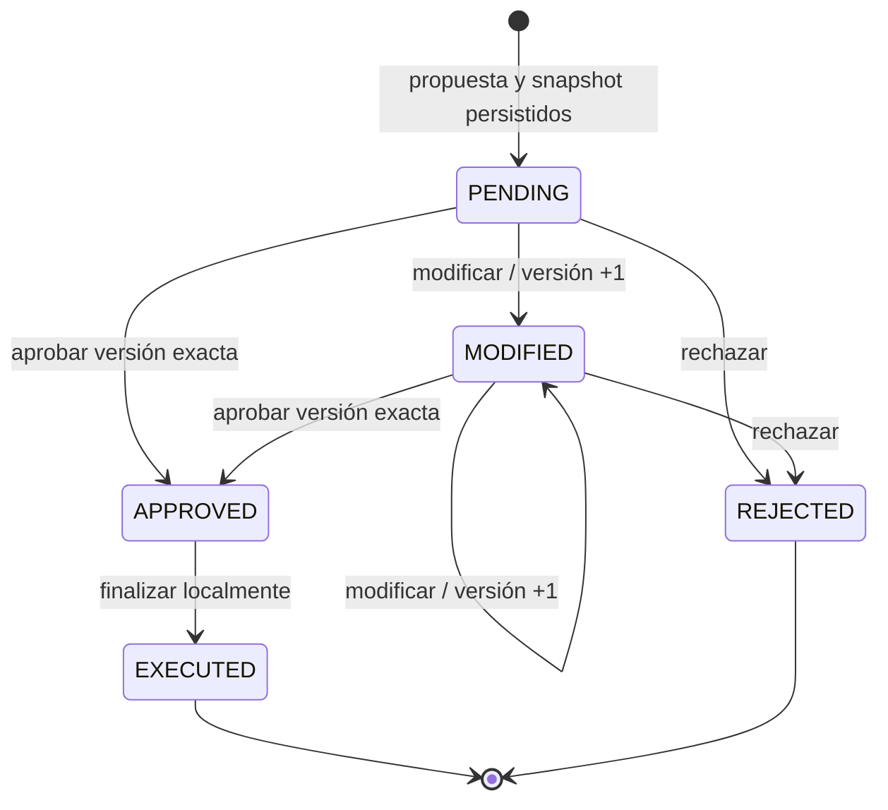

# HITL V1 — finalización supervisada de informes técnicos

**Dictamen: HITL COMPLETO para la acción local FINALIZE_TECHNICAL_REPORT.**

Cierre: 18/09/2026. Existe backend ejecutable, persistencia SQLite, revisión web y continuidad después de reinicio. Aprobar, modificar y rechazar no son mocks. Los proveedores de entrada de las pruebas son Fake/fixtures: esta tarea no constituye evidencia de razonamiento de un LLM real ni de disponibilidad del mercado. No declara completo el TFI en su conjunto.

## Baseline inspeccionada

Antes de editar se revisaron modelos, contrato reservado PendingAction, EquityAgent, reducer, repository SQLite y migración de events, API/OpenAPI, presenter, assets web, tests, README, arquitectura y auditoría del 17/09/2026. No se encontraron AGENTS.md aplicables en el repositorio ni en sus ancestros consultados.

`git status --short` estaba vacío; HEAD: `110357f7259228dbca9a5665a4fd3ad494b3db2c`. Los cambios técnicos previos del usuario estaban incorporados en ese HEAD. No se revirtieron cambios, modificaron fórmulas, relajaron tests ni borraron resultados. No hubo commit ni push.

| Verificación inicial | Resultado observado |
|---|---|
| Suite completa | 665 passed, 4 skipped, 2 warnings; 13,30 s |
| Integración | 81 passed, 4 skipped, 2 warnings; 7,50 s |
| Ruff check | PASS |
| Ruff format check | PASS, 95 archivos |
| pip check | PASS |
| Smoke API/Uvicorn | PASS |
| Evaluación técnica | 33/33, offline Fake |

No se tomaron los 665 tests documentados como prueba: se volvieron a ejecutar. Los warnings son las deprecaciones existentes Starlette/TestClient-httpx y anyio BlockingPortal. Los cuatro skips corresponden a dos pruebas live y dos LLM opt-in.

## Diseño y alcance

La acción concreta es **finalizar y guardar localmente el informe técnico revisado**. No publica en Internet, no envía mensajes y no opera instrumentos financieros. El borrador existe antes de la aprobación, pero no hay una publicación final ni una fila de resultado ejecutado hasta que el humano aprueba.

El pedido explícito «Prepará un informe técnico de GGAL para revisión» sigue el loop existente para resolver activo, obtener datos y calcular evaluación. Una compuerta determinista reconoce los verbos preparar/finalizar/publicar/confirmar junto con «informe técnico». Con ANSWER técnico COMPLETE/PARTIAL construye EvidenceSnapshot y PendingAction, persiste todo y responde PAUSED. No se depende de que el modelo invente una autorización. El pedido ordinario «Analizá técnicamente GGAL» conserva ANSWER inmediato.

No se agregó una tool que el LLM pueda invocar para aprobar. Las decisiones humanas pasan por endpoints separados. El reducer de observaciones financieras permanece intacto; la revisión tiene su propia máquina de estados persistente. Esto mantiene el loop y evita volver a consultar proveedores durante la continuación.

## Máquina de estados e invariantes



APPROVED y EXECUTED se registran dentro de **una misma transacción**. APPROVED es auditable y validado, pero no queda como un trabajo intermedio abandonado entre requests. Si ocurre un fallo antes del commit, la transacción vuelve al estado previo. No se añadieron estados EXPIRED/FAILED incompletos.

- `version` identifica la propuesta editorial; empieza en 1 y sólo aumenta al modificar. Aprobación y ejecución conservan esa versión.
- Sólo PENDING/MODIFIED admiten una decisión nueva; EXECUTED/REJECTED son terminales.
- El SHA-256 del snapshot se verifica al cargar. El hash de propuesta aprobado debe corresponder exactamente al payload que se finaliza.
- Ticker, métricas, señales, suficiencia, confianza, moneda, procedencia y fechas no son campos editables.
- Pydantic valida modelos completos, UUID, estados, timestamps con zona horaria y orden temporal, coherencia entre snapshot/trace/sesión, decisión y resultado.
- La finalización copia el reporte determinista ya guardado y sólo agrega `publication`. No vuelve a calcular indicadores ni reevalúa la antigüedad usando una fecha nueva.
- El resultado final preserva todos los campos del borrador financiero; su publicación identifica acción, versión aprobada, hash del snapshot, opciones editoriales y secciones.

## Contrato editorial

`changes` es un reemplazo de opciones editoriales con defaults, no un parche arbitrario de JSON:

```json
{
  "focus": "momentum",
  "include_sections": ["overview", "trend", "momentum", "risk"],
  "review_note": "Destacar la evolución del momentum en la revisión."
}
```

`focus` admite overview/trend/momentum/risk. La selección contiene entre una y cuatro secciones únicas y debe incluir el enfoque. El comentario admite hasta 500 caracteres. Se rechazan campos extra, controles inválidos, cambios financieros y nuevas dimensiones. Para otro ticker o datos nuevos hay que iniciar otra ejecución. Una nota humana es texto editorial literal, **no una instrucción ejecutable**; nunca se envía al LLM. La sección risk permanece obligatoriamente visible incluso si la selección editorial la omite, para no esconder limitaciones materiales.

## Persistencia y migración

Migración aditiva e idempotente al inicializar SQLiteRepository, sin eliminar tablas ni columnas. Las bases anteriores y sus traces siguen siendo legibles. Se conserva `analyses` y se agregan:

| Tabla | Contenido y restricciones |
|---|---|
| pending_actions | PK action_id, trace_id único/FK, session_id, status, version y documento JSON Pydantic completo |
| action_events | Secuencia autoincremental, FK action_id, evento sanitizado y copia de propuesta editorial de cada transición |
| action_decisions | PK compuesta action_id + SHA-256 de idempotency_key; hash de request y respuesta exacta persistida |
| report_publications | PK action_id, trace_id único/FK y FinalAnalysis serializado |

Hay índices por sesión, trace único y acción/secuencia de eventos. Todas las consultas usan parámetros. Las escrituras usan conexiones independientes con claves foráneas habilitadas y timeout SQLite de 10 segundos. `save(..., pending_action=...)` guarda análisis, acción y eventos de propuesta/pausa en una transacción: no puede devolver una acción utilizable si falló la persistencia.

El snapshot contiene **MarketHistory normalizado y FinalAnalysis tipado**, no objetos Python opacos ni payloads crudos de proveedor. Se conserva toda la evidencia necesaria para finalizar sin acceder a red. Las revisiones quedan en el historial y el reporte original permanece en el snapshot. La traza principal incorpora los eventos HITL y actualiza su estado al ejecutar/rechazar; al ejecutar también actualiza el resumen.

## Idempotencia y concurrencia

Cada decisión requiere `idempotency_key` de 8–100 caracteres alfanuméricos, guion o guion bajo, y `expected_version` entero estricto positivo. La clave se guarda hasheada; el payload normalizado completo de la decisión se identifica por otro SHA-256. La clave está acotada a la acción y la sesión se verifica antes de buscar una respuesta previa.

| Situación | Respuesta |
|---|---|
| Misma clave y mismo payload | 200, misma respuesta guardada, sin nueva ejecución |
| Misma clave y otro payload/decisión | 409 |
| Nueva clave para acción ya terminal | 409; GET permite recuperar el resultado |
| Versión vieja tras modificar | 409 |
| Acción inexistente o sesión incorrecta | 404 sin revelar pertenencia |
| Payload inválido/campos extra | 422 |
| Fallo SQLite | 503 con mensaje estable, sin detalles internos |
| Error interno inesperado | 500 con mensaje genérico; rollback |

`BEGIN IMMEDIATE` serializa escritores **en SQLite**, incluidos procesos distintos. La transición usa compare-and-swap por versión y estado. La publicación tiene PK por acción; aprobación, publicación, eventos y respuesta idempotente se confirman en la misma transacción. No existe un lock en memoria del que dependa la garantía. Dos aprobaciones con igual key obtienen el mismo resultado; con distintas keys una obtiene conflicto. Una carrera approve/reject admite sólo una decisión terminal.

La garantía se refiere a **una publicación persistida por acción** dentro de esta base. Una repetición completa de `/agent/run` crea otra acción independiente. La función pura de presentación puede volver a evaluarse si hubo rollback antes de confirmar, pero no deja dos publicaciones ni efectos externos. Esto no es un protocolo de exactly-once para servicios externos, que están fuera de alcance.

## API pública y compatibilidad

| Endpoint | Request / respuesta |
|---|---|
| POST /agent/run | Contrato anterior más PAUSED, pending_action y publication opcionales |
| POST /chat | Proyección existente; PAUSED presenta tarjeta segura |
| GET /agent/actions/{action_id}?session_id=... | ActionDecisionResponse con estado y resultado si EXECUTED |
| POST /agent/actions/{action_id}/approve | ApproveActionRequest → ActionDecisionResponse |
| POST /agent/actions/{action_id}/modify | ModifyActionRequest, agrega changes → nueva versión pendiente |
| POST /agent/actions/{action_id}/reject | RejectActionRequest → rechazo sin resultado |
| GET /agent/actions/{action_id}/events?session_id=... | Eventos HITL sanitizados de la misma sesión |

Se conservó HTTP 200 para `/agent/run`, incluida la pausa, en lugar de cambiar el contrato previo a 201. OpenAPI incluye los cinco schemas pedidos y permite completar el recorrido desde `/docs`.

La proyección pending_action incluye action_id, action_type, status, version, summary, ticker, as_of, proposed_payload editorial, editable_fields, available_actions, trace_id y session_id. No contiene snapshot interno, prompts ni respuestas crudas. El `/agent/run` pausado mantiene además el borrador técnico seguro en sus campos anteriores; `/chat` usa la proyección compacta.

El antiguo PendingAction reservado para watchlist/alertas no tenía consumidores y fue reemplazado por el contrato en `domain/actions.py`. Los clientes con enums cerrados deben agregar PAUSED y tolerar los campos opcionales nuevos. Las fórmulas, categorías técnicas y respuesta ordinaria permanecen iguales.

## Interfaz y observabilidad

La tarjeta muestra activo, resumen, fecha de evidencia, versión, estado y el aviso de que todavía no se finalizó. Los controles son select, checkboxes y textarea acotado, sin editor JSON. Aprobar rechaza cambios locales todavía no guardados; Modificar guarda otra versión y mantiene la necesidad de aprobación.

Durante la decisión se deshabilitan controles, se activa aria-busy y se informa «Guardando decisión…». Un guard sincrónico evita doble submit. Un retry de la misma decisión conserva su idempotency key en memoria. Un 409 recupera la acción mediante GET y requiere otra decisión consciente; no aprueba automáticamente la nueva versión. Se usan elementos nativos, labels, foco visible, teclado y regiones aria-live; todo texto usa textContent.

La pestaña conserva sólo session_id/action_id en sessionStorage. No usa localStorage ni guarda evidencia financiera en el navegador. Recargar recupera la acción desde SQLite; completar/rechazar limpia el action_id activo. Mientras hay revisión pendiente, la UI pide resolverla antes de iniciar otra consulta/conversación para no perder el identificador activo. La API permite múltiples acciones independientes por sesión.

Eventos: ACTION_PROPOSED, ACTION_PAUSED, ACTION_MODIFIED, ACTION_APPROVED, ACTION_REJECTED, ACTION_EXECUTED y ACTION_CONFLICT. Incluyen acción, trace, sesión, versión, transición, timestamp, outcome, actor categórico human/system, motivo categórico, hash de payload y hash de key cuando corresponde. No incluyen comentario libre, prompt, respuesta cruda, API key ni cookies. Las notas editoriales se conservan en la propuesta/historial, no en el evento sanitizado. `scripts/show_trace.py` agrega una línea legible HITL por transición.

## Pruebas agregadas y resultados finales

- `tests/unit/test_hitl_domain.py`: 19 casos de intención explícita, hashing normalizado, límites y campos financieros prohibidos.
- `tests/integration/test_hitl.py`: 37 casos de API, SQLite, migración, snapshots, timestamps, versiones, idempotencia, concurrencia, rollback, reinicio, errores y regresión del agente.
- `tests/integration/test_hitl_web.py`: dos pruebas; una ejecuta las ocho pruebas Node y otra verifica contratos de seguridad/accesibilidad de assets.
- `tests/web/hitl.test.cjs`: ocho pruebas contra el JavaScript real con un doble de DOM y fetch; sin librerías frontend añadidas. Node es opcional para instalar la app; si falta, pytest marca explícitamente esa prueba omitida.

| Verificación final | Resultado |
|---|---|
| Suite completa | **723 passed, 0 failed, 4 skipped, 2 warnings; 19,63 s** |
| Integración | **120 passed, 0 failed, 4 skipped, 2 warnings; 11,65 s** |
| Node UI | **8/8**, también ejecutado por pytest |
| Ruff check | PASS |
| Ruff format check | PASS, **103 archivos** |
| pip check, entorno principal | PASS |
| Smoke API desde checkout | PASS |
| Smoke HITL desde checkout | PASS; PAUSED, modify, reinicio de proceso, approve, replay, reject, una ejecución |
| Evaluación técnica V1 | **33/33**, 0 provider failures, fixtures/Fake |
| Evaluación HITL | **10/10**, OFFLINE_FAKE, duplicate_execution_count=0 |
| Wheel | Construida e instalada en `.venv-rc`, importación desde site-packages confirmada |
| Assets/skill en wheel | PASS, incluye código HITL, JavaScript y documentación del skill |
| pip check en entorno wheel | PASS tras instalar tzdata, dependencia ya declarada |
| Smoke API + HITL desde wheel y cwd externo | PASS, ambos ejecutados desde TEMP |
| Navegador | Flujo crear/modificar/recargar/aprobar y crear/rechazar verificados |
| Responsive/teclado | 375×812, 768×1024 y 1440×900 sin overflow horizontal; Tab, Enter y foco verificados |
| Servicios live o LLM real | **NOT_EVALUATED**, sin opt-in ni llamadas pagas |

La suite conserva los 665 tests iniciales y suma 58 tests pytest. Las ocho pruebas Node están contenidas en uno de esos 58, no se suman de nuevo al total pytest. Los warnings y cuatro skips son los mismos de la línea base.

La primera instalación `--no-deps` en el antiguo entorno `.venv-rc` detectó que faltaba tzdata y los smoke fallaron por ese motivo. Se instaló la dependencia existente mediante pip, se repitió pip check y ambos smoke aprobaron. La construcción/descarga necesitó permiso de red para PyPI; no se añadió ninguna dependencia al proyecto.

### Evaluación HITL versionada

`evals/hitl_v1_dataset.jsonl` contiene: GGAL aprobado, BMA modificado/aprobado, PAMP rechazado, aprobación repetida, modificación obsoleta, carrera approve/reject, recuperación tras reinicio, insuficiencia, error de mercado y activo ambiguo. El runner deriva métricas de respuestas/SQL/eventos; no usa el LLM para calificar ni atribuye razonamiento real a Fake.

| Métrica | Resultado | Muestras |
|---|---:|---:|
| proposal_accuracy | 1,0 | 10 |
| pause_before_execution | 1,0 | 7 |
| approval_success | 1,0 | 5 |
| modification_validation | 1,0 | 4 |
| rejection_success | 1,0 | 1 |
| duplicate_execution_count | **0** | Todas las publicaciones/eventos |
| stale_version_rejections | 1 | 1 intento obsoleto |
| trace_completeness | 1,0 | 7 |
| recovery_after_restart | 1,0 | 1 |

Artefactos locales ignorados, no enlaces portables en un clon:

- `evals/results/hitl-final-verification/pytest.txt` e `integration.txt`.
- `evals/results/hitl-v1-20260918T023130188969Z/`: summary.json, diez respuestas completas con requests/decisiones/traces y diez SQLite.
- `evals/results/technical-v1-fake-20260918T023126071401Z/evaluation.json`: regresión 33/33.
- `evals/results/hitl-final-verification/wheel/merval_equity_agent-0.1.0-py3-none-any.whl`; SHA-256 `89dbbc175f03b854b4731360957844cb675457a9a2a84dec1b430b66675b3a4a`.
- `data/hitl-demo.sqlite3`: decisiones manuales de navegador, con mercado sintético. Se conserva y no se publica.

## Demo reproducible completa

Desde la raíz, iniciar el servidor **offline** (Fake + mercado sintético; no lee `.env`):

```powershell
.venv\Scripts\python.exe -m uvicorn demo_hitl:create_demo --factory --app-dir scripts --host 127.0.0.1 --port 8010
```

Abrir `http://127.0.0.1:8010/` para la UI o `/docs` para el recorrido OpenAPI. La marca live en el fixture sirve únicamente para ejercitar la validación del adapter; la fuente `synthetic-market.test` y el runner identifican la simulación. No son cotizaciones reales.

En otra terminal, crear, consultar, modificar, aprobar y repetir la aprobación:

```powershell
$hitlBase = 'http://127.0.0.1:8010'
$hitlSession = [guid]::NewGuid().ToString()
function Post-Hitl($path, $body) {
    Invoke-RestMethod "$hitlBase$path" -Method Post -ContentType 'application/json; charset=utf-8' -Body ([Text.Encoding]::UTF8.GetBytes(($body | ConvertTo-Json -Depth 20)))
}
$paused = Post-Hitl '/agent/run' @{message='Prepará un informe técnico de GGAL para revisión.'; session_id=$hitlSession}
$paused.status # PAUSED
$actionPath = '/agent/actions/' + $paused.pending_action.action_id
Invoke-RestMethod "$hitlBase${actionPath}?session_id=$hitlSession"
$modified = Post-Hitl "$actionPath/modify" @{
    session_id=$hitlSession; expected_version=1; idempotency_key=[guid]::NewGuid().ToString()
    changes=@{focus='momentum'; include_sections=@('overview','momentum','risk'); review_note='Dar prioridad a momentum en la presentación.'}
}
$modified.action.status # MODIFIED, versión 2, sin resultado
$approveBody = @{session_id=$hitlSession; expected_version=2; idempotency_key=[guid]::NewGuid().ToString(); comment='Versión editorial revisada'}
$approved = Post-Hitl "$actionPath/approve" $approveBody
$replayed = Post-Hitl "$actionPath/approve" $approveBody
$approved.action.status # EXECUTED
($approved.result | ConvertTo-Json -Depth 50) -eq ($replayed.result | ConvertTo-Json -Depth 50) # True
$events = Invoke-RestMethod "$hitlBase${actionPath}/events?session_id=$hitlSession"
@($events | Where-Object event -eq 'ACTION_EXECUTED').Count # 1
.venv\Scripts\python.exe scripts/show_trace.py $paused.trace_id --database data/hitl-demo.sqlite3
```

Aprobar directamente otra propuesta no requiere modificar; usa expected_version=1. Ejemplo completo de rechazo sobre una acción independiente:

```powershell
$other = Post-Hitl '/agent/run' @{message='Prepará un informe técnico de PAMP para revisión.'; session_id=$hitlSession}
$rejectPath = '/agent/actions/' + $other.pending_action.action_id
$rejected = Post-Hitl "$rejectPath/reject" @{
    session_id=$hitlSession; expected_version=1
    idempotency_key=[guid]::NewGuid().ToString(); comment='No finalizar este borrador'
}
$rejected.action.status # REJECTED
$null -eq $rejected.result # True
Invoke-RestMethod "$hitlBase${rejectPath}/events?session_id=$hitlSession"
```

Para demostrar persistencia manual, detener Uvicorn **después de PAUSED o MODIFIED**, volver a iniciarlo con el mismo archivo SQLite y continuar con action_id/session_id guardados. El smoke automatiza ese reinicio de proceso. `Ctrl+C` cierra el servidor de demo.

## Comandos de verificación ejecutados

```powershell
git status --short
$env:RUN_LIVE_TESTS='0'; $env:RUN_LLM_TESTS='0'
.venv\Scripts\python.exe -m pytest -q -ra
.venv\Scripts\python.exe -m ruff check src tests scripts
.venv\Scripts\python.exe -m ruff format --check src tests scripts
.venv\Scripts\python.exe -m pip check
.venv\Scripts\python.exe -m pytest tests/integration -q -ra
.venv\Scripts\python.exe scripts/smoke_api.py
.venv\Scripts\python.exe scripts/smoke_hitl.py
.venv\Scripts\python.exe scripts/eval_technical_v1.py
.venv\Scripts\python.exe scripts/eval_hitl.py
node --test tests/web/hitl.test.cjs
.venv\Scripts\python.exe -m pip wheel . --no-deps --wheel-dir evals/results/hitl-final-verification/wheel
.venv-rc\Scripts\python.exe -m pip install --no-deps --force-reinstall evals/results/hitl-final-verification/wheel/merval_equity_agent-0.1.0-py3-none-any.whl
# Resolver también dependencias declaradas en el entorno de wheel:
.venv-rc\Scripts\python.exe -m pip install evals/results/hitl-final-verification/wheel/merval_equity_agent-0.1.0-py3-none-any.whl
.venv-rc\Scripts\python.exe -m pip check
# smoke_api.py y smoke_hitl.py se repitieron con ese intérprete desde TEMP,
# usando paths absolutos y confirmando importación desde site-packages.
git diff --check
```

## Matriz de aceptación

| Criterio | Estado | Evidencia |
|---|---|---|
| Acción concreta y pausa antes de finalizar | PASS | report_publications vacío en PAUSED |
| Propuesta persistida | PASS | snapshot y acción en SQLite, transacción con analyses |
| Approve funcional | PASS | resultado determinista y publicación persistida |
| Modify funcional | PASS | versión +1, continúa pendiente |
| Reject funcional | PASS | terminal sin resultado, evidencia conservada |
| Continuar tras reiniciar | PASS | smoke reinicia Uvicorn antes de aprobar |
| No duplicar ejecución | PASS | PK, transacción, concurrencia, replay, métrica 0 |
| Control de versión | PASS | CAS, aprobación/modificación obsoleta 409 |
| Idempotencia | PASS | misma clave/payload devuelve misma respuesta |
| Trazas completas | PASS | siete eventos HITL, campos sanitizados e inspector |
| UI con las tres decisiones | PASS | backend real + navegador + ocho pruebas JS |
| /docs reproduce el recorrido | PASS | endpoints/schemas OpenAPI y smoke /docs |
| Métricas financieras inmutables | PASS | comparación completa con snapshot y rechazo de extras |
| Aprobar sin mercado | PASS | tools retiradas durante reanudación en tests/evaluación |
| Aprobar sin LLM | PASS | provider retirado durante reanudación en tests/evaluación |
| Tests anteriores verdes | PASS | suite 665 → 723, sin editar tests previos |
| Técnica 33/33 | PASS | runner V1 sin alterar fórmulas |
| Ruff y formato | PASS | 103 archivos |
| pip check | PASS | principal y wheel |
| Smoke API y HITL | PASS | checkout y wheel |
| Wheel y frontend instalado | PASS | importación site-packages y assets comprobados |
| Documentación/código consistentes | PASS | contratos, demo y límites explícitos |
| Live / LLM real en esta tarea | NOT_EVALUATED | opt-in deshabilitado |
| Python 3.11 | NOT_EVALUATED | validación en Python 3.14.6; deuda previa |

## Archivos y separación del trabajo

**Cambios previos:** árbol inicial limpio; se conserva HEAD como baseline. Las auditorías históricas describen momentos previos y no se reescriben para cambiar retrospectivamente su dictamen.

**Cambios de esta tarea:**

- Nuevos: `domain/actions.py`, `memory/actions.py`; `scripts/demo_hitl.py`, `eval_hitl.py`, `smoke_hitl.py`; `evals/hitl_v1_dataset.jsonl`; los cuatro archivos de tests HITL/JS; este informe.
- Modificados: `domain/models.py`, `agents/equity_agent.py`, `memory/repository.py`, `memory/sqlite.py`, `api/app.py`, `api/web/{app.js,index.html,styles.css}`, `presentation/{models.py,presenter.py}` y `scripts/show_trace.py`.
- Documentación actualizada: README, arquitectura, skill del proyecto y contracts.md. No se agregó framework ni dependencia frontend/Python.

Los paths de dominio/memoria/API/presentación indicados corresponden a `src/merval_agent/`. Los tests son `tests/unit/test_hitl_domain.py`, `tests/integration/test_hitl.py`, `tests/integration/test_hitl_web.py`, `tests/web/hitl.test.cjs`.

**Artefactos locales ignorados:** resultados bajo evals/results, SQLite de demo, build y entorno `.venv-rc` actualizado para validar wheel. No se eliminaron resultados anteriores. No se leyó ni modificó `.env` desde herramientas de inspección; la demo nueva usa Settings(_env_file=None).

**Resultados Fake:** todas las pruebas de esta tarea usan simulación de datos/proveedor; las decisiones HITL, transacciones, API y UI son las implementaciones reales. **Resultados live/LLM:** ninguno nuevo.

## Riesgos abiertos e impacto en TFI

- `session_id` **no es autenticación** ni prueba de identidad. `actor=human` es categórico. Usar localmente; antes de exponer a Internet hacen falta autenticación/autorización, políticas de acceso, límites y TLS.
- SHA-256 detecta alteraciones accidentales del snapshot, no protege contra un administrador malicioso que pueda reescribir toda la base y sus hashes.
- La evidencia puede envejecer durante la pausa. Aprobar conserva la fecha original; para actualizar precios se crea otra ejecución. No hay caducidad automática.
- SQLite serializa escrituras; carga alta o un efecto externo futuro necesitarían otro diseño. No se extiende la garantía transaccional a emails, brokers ni servicios de terceros.
- sessionStorage recupera la misma pestaña tras recarga. Al cerrar la pestaña hay que conservar action_id/session_id para recuperar mediante API; no hay listado global de acciones ni memoria conversacional nueva.
- Python 3.11, CI y evaluación live actual siguen pendientes de la auditoría anterior. Cerrar HITL no elimina esas brechas ni implementa fundamentales/RAG/multiagente.

Respecto de las pautas oficiales aportadas en la conversación, el componente Human-in-the-Loop pasa de **FAIL a PASS para este caso vertical**: una acción se pausa, puede modificarse/aprobarse/rechazarse y se continúa persistentemente. También se amplía evidencia de estado/memoria, interfaz y trazabilidad. No se afirma que esto cierre toda la entrega final ni reemplaza una evaluación del docente. Las fórmulas y la V1 técnica conservan su regresión.

Mensaje de commit propuesto, **no ejecutado**:

```text
feat(hitl): persist versioned technical report review with idempotent decisions

Add transactional SQLite approval, editorial modification and rejection,
resume from immutable snapshots, expose action API and accessible review UI,
and verify restart/concurrency with offline HITL evaluations and wheel smoke.
```
